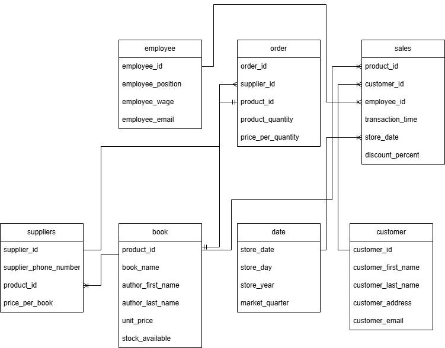
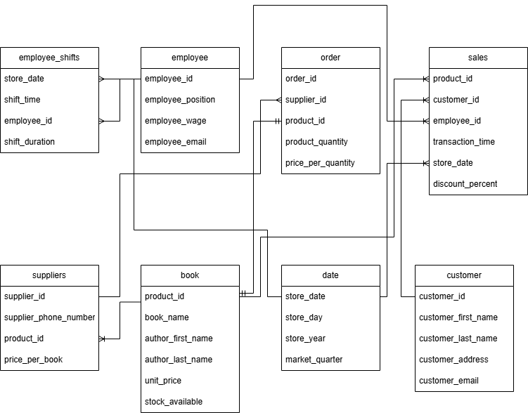

# Assignment 2: Design a Logical Model and Advanced SQL

🚨 **Please review our [Assignment Submission Guide](https://github.com/UofT-DSI/onboarding/blob/main/onboarding_documents/submissions.md)** 🚨 for detailed instructions on how to format, branch, and submit your work. Following these guidelines is crucial for your submissions to be evaluated correctly.

#### Submission Parameters:
* Submission Due Date: `February 1, 2025`
* Weight: 70% of total grade
* The branch name for your repo should be: `assignment-two`
* What to submit for this assignment:
    * This markdown (Assignment2.md) with written responses in Section 1 and 4
    * Two Entity-Relationship Diagrams (preferably in a pdf, jpeg, png format).
    * One .sql file 
* What the pull request link should look like for this assignment: `https://github.com/<your_github_username>/sql/pulls/<pr_id>`
    * Open a private window in your browser. Copy and paste the link to your pull request into the address bar. Make sure you can see your pull request properly. This helps the technical facilitator and learning support staff review your submission easily.

Checklist:
- [ ] Create a branch called `assignment-two`.
- [ ] Ensure that the repository is public.
- [ ] Review [the PR description guidelines](https://github.com/UofT-DSI/onboarding/blob/main/onboarding_documents/submissions.md#guidelines-for-pull-request-descriptions) and adhere to them.
- [ ] Verify that the link is accessible in a private browser window.

If you encounter any difficulties or have questions, please don't hesitate to reach out to our team via our Slack. Our Technical Facilitators and Learning Support staff are here to help you navigate any challenges.

***

## Section 1:
You can start this section following *session 1*, but you may want to wait until you feel comfortable wtih basic SQL query writing. 

Steps to complete this part of the assignment:
- Design a logical data model
- Duplicate the logical data model and add another table to it following the instructions
- Write, within this markdown file, an answer to Prompt 3


###  Design a Logical Model

#### Prompt 1
Design a logical model for a small bookstore. 📚

At the minimum it should have employee, order, sales, customer, and book entities (tables). Determine sensible column and table design based on what you know about these concepts. Keep it simple, but work out sensible relationships to keep tables reasonably sized. 

Additionally, include a date table. 

There are several tools online you can use, I'd recommend [Draw.io](https://www.drawio.com/) or [LucidChart](https://www.lucidchart.com/pages/).

**HINT:** You do not need to create any data for this prompt. This is a conceptual model only. 
## Aidan's Diagram


#### Prompt 2
We want to create employee shifts, splitting up the day into morning and evening. Add this to the ERD.
## Aidan's Diagram


#### Prompt 3
The store wants to keep customer addresses. Propose two architectures for the CUSTOMER_ADDRESS table, one that will retain changes, and another that will overwrite. Which is type 1, which is type 2? 

**HINT:** search type 1 vs type 2 slowly changing dimensions. 

```
Your answer...
From my googling and asking those around me more wise in SQL than I: Type 1 is overwriting older data/values such that 
it is replaced by the new values/data and there is no record of past data. Type 2 adds the newer data while still retaining
 a historical record of past data. In this context, a type 1 architecture would involve having the customer_address table 
 having columns like city, postal_code, street_address, and customer_id, and simply overwriting the value when customers move. 
 A type 2 architecture might be having additional columns like is_current_address and a column containing the move date/date 
 the address was first/last occuppied by the customer.

```

***

## Section 2:
You can start this section following *session 4*.

Steps to complete this part of the assignment:
- Open the assignment2.sql file in DB Browser for SQLite:
	- from [Github](./02_activities/assignments/assignment2.sql)
	- or, from your local forked repository  
- Complete each question


### Write SQL

#### COALESCE
1. Our favourite manager wants a detailed long list of products, but is afraid of tables! We tell them, no problem! We can produce a list with all of the appropriate details. 

Using the following syntax you create our super cool and not at all needy manager a list:
```
SELECT 
product_name || ', ' || product_size|| ' (' || product_qty_type || ')'
FROM product
```

But wait! The product table has some bad data (a few NULL values). 
Find the NULLs and then using COALESCE, replace the NULL with a blank for the first problem, and 'unit' for the second problem. 

**HINT**: keep the syntax the same, but edited the correct components with the string. The `||` values concatenate the columns into strings. Edit the appropriate columns -- you're making two edits -- and the NULL rows will be fixed. All the other rows will remain the same.

<div align="center">-</div>

#### Windowed Functions
1. Write a query that selects from the customer_purchases table and numbers each customer’s visits to the farmer’s market (labeling each market date with a different number). Each customer’s first visit is labeled 1, second visit is labeled 2, etc. 

You can either display all rows in the customer_purchases table, with the counter changing on each new market date for each customer, or select only the unique market dates per customer (without purchase details) and number those visits. 

**HINT**: One of these approaches uses ROW_NUMBER() and one uses DENSE_RANK().

2. Reverse the numbering of the query from a part so each customer’s most recent visit is labeled 1, then write another query that uses this one as a subquery (or temp table) and filters the results to only the customer’s most recent visit.

3. Using a COUNT() window function, include a value along with each row of the customer_purchases table that indicates how many different times that customer has purchased that product_id.

<div align="center">-</div>

#### String manipulations
1. Some product names in the product table have descriptions like "Jar" or "Organic". These are separated from the product name with a hyphen. Create a column using SUBSTR (and a couple of other commands) that captures these, but is otherwise NULL. Remove any trailing or leading whitespaces. Don't just use a case statement for each product! 

| product_name               | description |
|----------------------------|-------------|
| Habanero Peppers - Organic | Organic     |

**HINT**: you might need to use INSTR(product_name,'-') to find the hyphens. INSTR will help split the column. 

<div align="center">-</div>

#### UNION
1. Using a UNION, write a query that displays the market dates with the highest and lowest total sales.

**HINT**: There are a possibly a few ways to do this query, but if you're struggling, try the following: 1) Create a CTE/Temp Table to find sales values grouped dates; 2) Create another CTE/Temp table with a rank windowed function on the previous query to create "best day" and "worst day"; 3) Query the second temp table twice, once for the best day, once for the worst day, with a UNION binding them. 

***

## Section 3:
You can start this section following *session 5*.

Steps to complete this part of the assignment:
- Open the assignment2.sql file in DB Browser for SQLite:
	- from [Github](./02_activities/assignments/assignment2.sql)
	- or, from your local forked repository  
- Complete each question

### Write SQL

#### Cross Join
1. Suppose every vendor in the `vendor_inventory` table had 5 of each of their products to sell to **every** customer on record. How much money would each vendor make per product? Show this by vendor_name and product name, rather than using the IDs.

**HINT**: Be sure you select only relevant columns and rows. Remember, CROSS JOIN will explode your table rows, so CROSS JOIN should likely be a subquery. Think a bit about the row counts: how many distinct vendors, product names are there (x)? How many customers are there (y). Before your final group by you should have the product of those two queries (x\*y). 

<div align="center">-</div>

#### INSERT
1. Create a new table "product_units". This table will contain only products where the `product_qty_type = 'unit'`. It should use all of the columns from the product table, as well as a new column for the `CURRENT_TIMESTAMP`.  Name the timestamp column `snapshot_timestamp`.

2. Using `INSERT`, add a new row to the product_unit table (with an updated timestamp). This can be any product you desire (e.g. add another record for Apple Pie). 

<div align="center">-</div>

#### DELETE 
1. Delete the older record for the whatever product you added.

**HINT**: If you don't specify a WHERE clause, [you are going to have a bad time](https://imgflip.com/i/8iq872).

<div align="center">-</div>

#### UPDATE
1. We want to add the current_quantity to the product_units table. First, add a new column, `current_quantity` to the table using the following syntax.
```
ALTER TABLE product_units
ADD current_quantity INT;
```

Then, using `UPDATE`, change the current_quantity equal to the **last** `quantity` value from the vendor_inventory details. 

**HINT**: This one is pretty hard. First, determine how to get the "last" quantity per product. Second, coalesce null values to 0 (if you don't have null values, figure out how to rearrange your query so you do.) Third, `SET current_quantity = (...your select statement...)`, remembering that WHERE can only accommodate one column. Finally, make sure you have a WHERE statement to update the right row, you'll need to use `product_units.product_id` to refer to the correct row within the product_units table. When you have all of these components, you can run the update statement.

*** 

## Section 4:
You can start this section anytime.

Steps to complete this part of the assignment:
- Read the article
- Write, within this markdown file, <1000 words.

### Ethics

Read: Boykis, V. (2019, October 16). _Neural nets are just people all the way down._ Normcore Tech. <br>
    https://vicki.substack.com/p/neural-nets-are-just-people-all-the

**What are the ethical issues important to this story?**

Consider, for example, concepts of labour, bias, LLM proliferation, moderating content, intersection of technology and society, ect. 


```
Your (too many) thoughts...

The post was an interesting read, albeit it felt a little like “old news” through no fault to the author, they were totally on it when they made the post and I might be a little more informed on the topic compared to others. It’s a general topic my PI and I discuss frequently as we specifically research effort/labour and have gotten into human-AI interaction within the effort context. The main theme that bubbled up to me was that AI, or the organizations behind them, often erase the massive contribution of human effort into developing “autonomous” systems with the aim of replacing or augmenting the very labour used to produce them. It also begs the questions of whether AI has any ability to “stand on its own” and “replace people.”
In the contexts where it does “replace” people – human effort is exploited to eventually harm/come at a cost towards humans. This obviously sucks and is a big ethical concern of using humans to remove humans from the labour force. The companies seeking to actively exploit human effort for these systems likely will not give proper credit to the human effort required to develop them or “give back” proportionally to the work invested by people. It’s especially pointed when that labour comes at barely minimum wage – if that – through the use of M Turk workers.
In a more general sense, the reliance on humans in training these systems also means AI is subject to many biases that humans are subject to along with its own unique biases, all while appearing neutral or objective/logical. This can perpetuate awful prejudices and give artificial truth to completely incorrect stereotypes/generalizations. All of this is terrifying, especially if AI takes on more important/authoritative positions within society. It’s worth noting that people tend to generally distrust AI for subjective judgments, but this might change with demographics (e.g., cultural or generational; https://doi.org/10.1016/j.techfore.2021.121390). Young people tend to be more trusting of AI, additionally China, and to an extent Japan, has shown to be much more trusting of AI companions than any other region. A lot of this probably comes from familiarity – though certain cultural teachings (e.g., Shinto beliefs allowing for non-humans/inanimate objects to contain spirits vs. a more restrictive Protestant belief) are believed to predispose people towards accepting/rejecting AI (e.g., https://doi.org/10.31234/osf.io/wc895). Additionally, people tend to trust AI for judgments perceived as less “subjective” (e.g., predicting the weather, or providing facts/information). The AI aversion, prior algorithm aversion, literature is super cool to explore!
As a brief personal ramble: The last point is partly why AI is causing so many issues for human learning, where many believe products like GPT have authority on any given topic. From personal experience with my research, GPT has been very strongly opinionated (to a point of shutting down the conversation when I suggested personality traits are stable across life – the accepted position among personality researchers right now). Or when I’d try to test out its ability at summarizing article PDFs, it would completely misinterpret the conclusions, making up/completely extrapolating points made in the papers. I recently saw a BSky post from a law school graduate “friend-of-a-friend” pleading with people to never use GPT for legal advice as it would “lie” about 30-40% of the time in their own testing. This is part of the reason I avoid Twitter (X) where possible. The amount of AI-slop (as my friends and I colloquially refer to it) that is shoveled onto our feeds under the guise of being an “informative” source/account was almost as infuriating as the plethora of other problems the platform faces. Outside of bot-accounts, I cannot count how many times I have seen people on platforms post pictures of ChatGPT responses as definitive answers to online arguments they were having as some sort of “mic-drop” moment.
To continue more on-topic, the threat of AI replacing human labour is obviously concerning for a number of reasons – namely unemployment, dropping wages, and the fact that people genuinely value working or being generative towards society. Though, we recently ran some studies demonstrating that people are equally (if not more) happy when they get to do generative/effortful leisure instead of work (sorry Protestant work ethic).
Given that it seems inevitable that we must confront AI and “autonomous systems” being common-place in the work environment, I’m generally torn about using AI tools to replace human work – but ultimately land along the lines of using AI to reinforce human work. Mental healthcare comes to mind as a domain with limited funding, and not nearly enough human workers to meet growing demands. Some cool work from a UofT lab started testing the efficacy of LLM-based mental health “buddies” to help students with relatively lower mental health needs (https://osf.io/preprints/psyarxiv/xj7cz). The idea being, if AI is even “okay” at providing good service, we could take some of the pressure off human mental health workers so that those with more serious needs can be helped. Many LLM tools, though, can create unrealistic expectations or perceptions through being so agreeable. As one example a recent paper out of my lab demonstrated that AI responses are generally perceived as more empathetic than human responses (https://doi.org/10.1038/s44271-024-00182-6). People tend to find AI friendlier and more accepting of them – partially because it is. Empathy is hard work and people don’t like giving it out easily, while AI is readily available. Yet, this doesn’t mean that AI is empathetic nor does it mean that AI empathetic responses serve the same purposes as human empathy. 
To play my own devil’s advocate, though, a study my PI and I ran and published recently demonstrated that people find their work to be less meaningful when aided by AI – despite putting out higher quality product (https://doi.org/10.1016/j.cognition.2025.106065). But maybe the issue here was that the work was no longer challenging or didn’t give enough agency to the worker – thus the task needs to adequately match the combined abilities of a human with AI.
Personal interests and research referencing aside, the threat all of this has to human work and ownership of that work along with the real damage AI can do, pushing incorrect biases through as fact, is real and should prompt intense regulatory efforts. The pure amount of LLM/other AI tools out there for people to use for their own purposes makes me want to agree with those saying Pandora's box is open in terms of hoping to moderate/regulate what these tools can/will do and put out there. Maybe there is hope for us to stem the bleeding if efforts are made soon, but of course, a quick glance at the political/social landscape makes me lean towards cynicism – though I know there are many doing good work to try and push on these topics.
```
